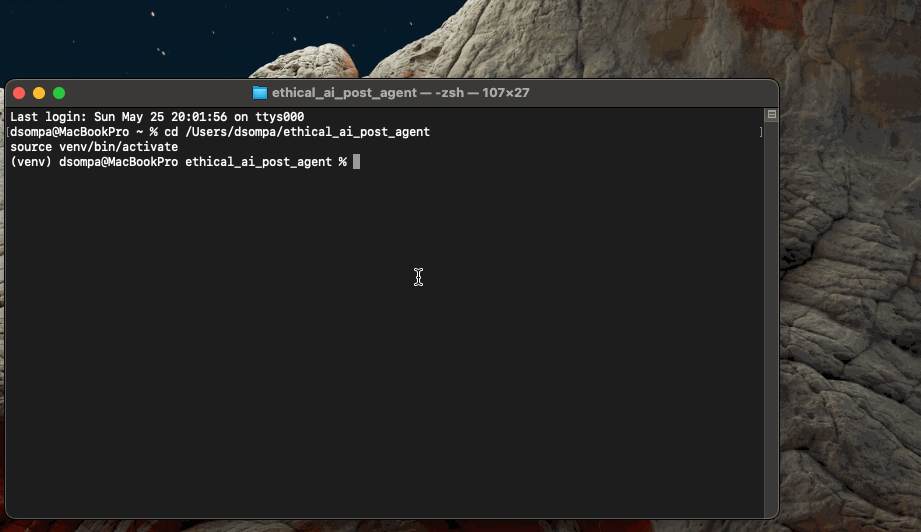

# ethical_ai_post_agent

The **Ethical AI Post Agent** is an automated content generation tool designed to post professional, well-crafted updates on topics such as AI Ethics, Bias, Diversity, Fairness, and Responsible AI.

It was built to reduce repetitive content creation for LinkedIn while maintaining high-quality standards and raising awareness on key issues in artificial intelligence.

---

## Key Features

- Generates posts from curated `topics.yaml` entries
- Uses a modular prompt system (`prompt.txt`)
- Supports fully automated scheduling via cron jobs
- Seamlessly integrates with OpenAI API
- Posts are:
  - Under 250 words
  - Written in a clear, professional tone
  - Focused on awareness and constructive discourse
  - Free of emojis and fluff

---

## Current Capabilities

✅ YAML-based topic curation  
✅ Dynamic prompt processing  
✅ Autonomous post generation  
✅ OpenAI API integration fully functional  
✅ Scheduled posting every Wednesday at 13:00  
⏳ LinkedIn API integration in progress  
⏳ Auto-sourcing of reference links (planned)  

---

## Tech Stack

| Tool         | Purpose                          |
|--------------|----------------------------------|
| Python 3.11  | Core language                    |
| OpenAI GPT-4 | Text generation                  |
| PyYAML       | YAML integration                 |
| Cron         | Scheduled post execution         |
| GitHub       | Version control                  |
| Notion       | Project management (optional)    |

---

## Demo

The following GIF demonstrates the full pipeline in action:  
From selecting a YAML topic to generating a GPT-4-based post and saving it as Markdown in the output folder.

*Automatically generated post by the `ethical_ai_post_agent`.*

---

## Goals
- Raise awareness for bias in AI
- Automate LinkedIn posts with YAML prompts
- Generate posts with GPT-4 via OpenAI API
- Structure & log posts as Markdown for traceability

---

## Motivation & Inspiration

As AI systems increasingly influence social, economic, and political realities, it's crucial to embed ethics into the development pipeline.  
This agent was built to:

- Make bias and fairness in LLMs more visible  
- Automate education on overlooked but critical topics  
- Support responsible AI communication in public discourse

`ethical_ai_post_agent` is my way of using technology to bring **awareness, reflection, and change** into the feed.

🧠 Let’s build AI with **intention** — not just with instructions.

---
## Features
- Parses topic YAML from `data/topics.yaml`
- Uses `gpt-3.5-turbo` or `gpt-4` to generate posts
- Creates `.md` files inside `/posts`
- Logs output in `/logs`
- Optional: image prompts & DALL·E support
- Secure API key handling with `.env`

---

## Project Structure

ethical_ai_post_agent/  
├── data/                  # YAML input topics  
│   └── topics.yaml  
├── posts/                 # Generated posts (.md)  
├── logs/                  # Logs (optional)  
├── main.py                # Agent logic  
├── config.yaml            # Parameters & settings  
├── test_connection.py     # Optional API test script  
├── .env                   # API key (excluded via .gitignore)  
└── README.md

---

## To Do
- [x] Connect GPT-4 for generation
- [ ] Finalize LinkedIn API integration (read/write to company pages)
- [ ] Implement fallback post queue
- [ ] Add auto-screenshot of generated posts for documentation
- [ ] Build minimal frontend CLI interface
- [ ] Improve link recommendation with curated database
- [ ] Community Mode: Support multiple contributors

---

## License

This project is part of the **FemAI Community** and will be released under an open-source license once core functionality is stable.
Don't build disinfo-bots 🙏

---

## Maintainer

Made with ❤️ by [shinan.dev](https://github.com/shinanDev)  
GPG-signed & committed.  
Ambassador for Ethical AI — always open for feedback and collaboration.
