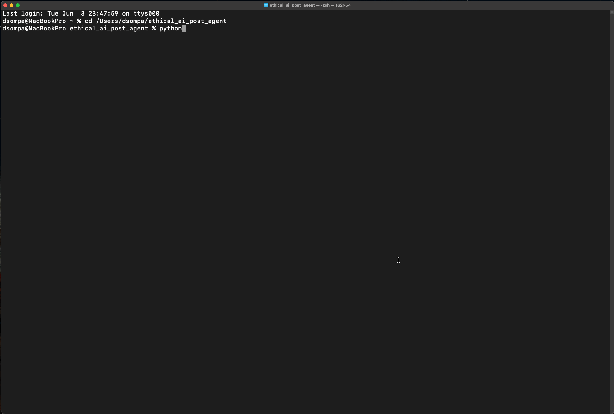

# ethical_ai_post_agent

💡 Bias & Diversity in LLMs – Fully Automated LinkedIn Content Agent

This Python-based agent generates, schedules, and logs thought-leadership posts on ethical AI topics (e.g., bias, fairness, transparency) using GPT-4 and YAML-based topic files.

---

## Highlights

✅ YAML-driven topic management  
✅ GPT-4 content generation via OpenAI API  
✅ Markdown output + logging  
✅ Clean code & CLI-friendly  
✅ Ready for LinkedIn scheduling & DALL·E extension

---

## Tech Stack

| Tool        | Purpose                         |
|-------------|----------------------------------|
| Python 3.13 | Core language                    |
| OpenAI API  | Text generation                  |
| PyYAML      | YAML integration                 |
| Schedule    | Timed task execution             |
| dotenv      | API key handling                 |

---

## Demo

The following GIF demonstrates how a YAML-based topic is converted into Markdown text and saved locally.

📍 *Output directory: `posts/` + logs in `logs/`*

*Automatically generated post by the `ethical_ai_post_agent`.*

---

## Goals
- Raise awareness for bias in AI
- Automate LinkedIn posts with YAML prompts
- Generate posts with GPT-4 via OpenAI API
- Structure & log posts as Markdown for traceability

---

## Motivation & Inspiration

As artificial intelligence increasingly makes critical decisions, it's essential not to overlook the **ethical questions**.

This project was born from a desire to contribute by:

- **Raising visibility** for bias & fairness in LLMs  
- **Automating education** on topics that often stay in the shadow of technical hype  
- **Promoting responsible AI systems** that include rather than exclude people

`ethical_ai_post_agent` is my way of using technology to bring **awareness, reflection, and change** into the feed.

🧠 Let’s build AI with **intention** — not just with instructions.

---
## Features
- Parses topic YAML from `data/topics.yaml`
- Uses `gpt-3.5-turbo` or `gpt-4` to generate posts
- Creates `.md` files inside `/posts`
- Logs output in `/logs`
- Optional: image prompts & DALL·E support
- Secure API key handling with `.env`

---

## Project Structure

ethical_ai_post_agent/  
├── data/                  # YAML input topics  
│   └── topics.yaml  
├── posts/                 # Generated posts (.md)  
├── logs/                  # Logs (optional)  
├── main.py                # Agent logic  
├── config.yaml            # Parameters & settings  
├── test_connection.py     # Optional API test script  
├── .env                   # API key (excluded via .gitignore)  
└── README.md

---

## To Do
- [x] Connect GPT-4 for generation
- [ ] Add LinkedIn scheduling (via API)
- [ ] Integrate DALL·E for visual content
- [ ] Web dashboard (optional)
- [ ] Post-validation with regex / review

---

## License

MIT License – Use responsibly.  
Don't build disinfo-bots 🙏

---

## Maintainer

Made with ❤️ by [shinan.dev](https://github.com/shinanDev)  
GPG-signed & committed.  
Ambassador for Ethical AI
